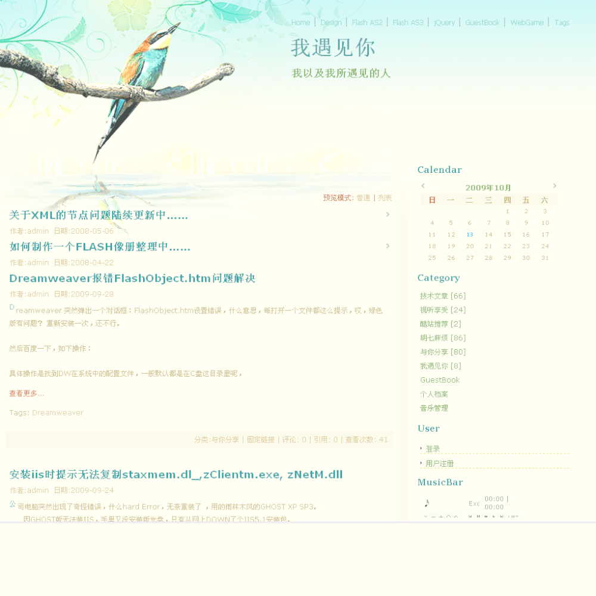
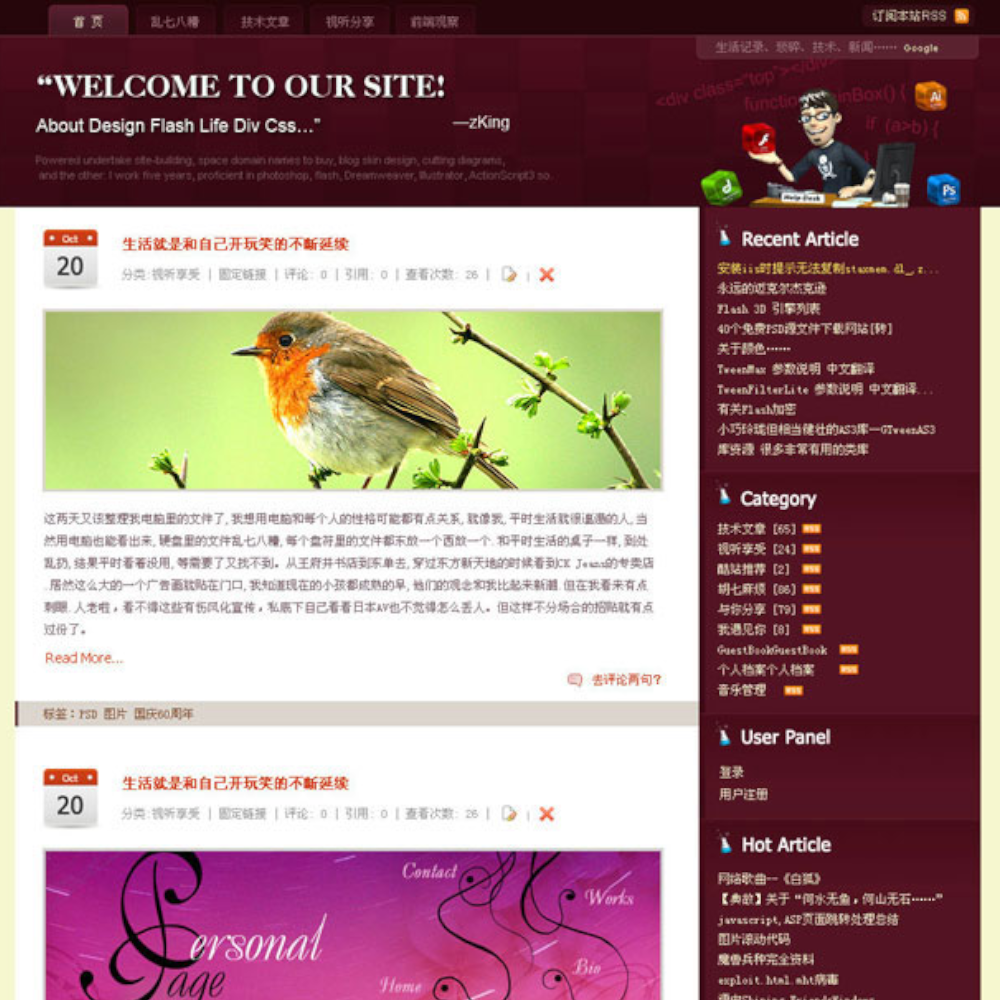
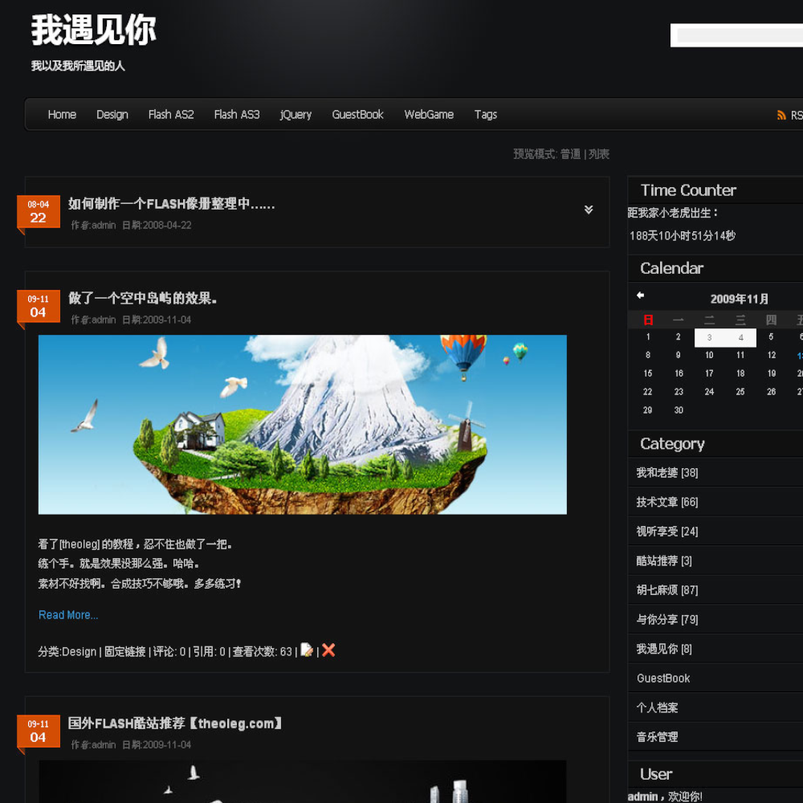
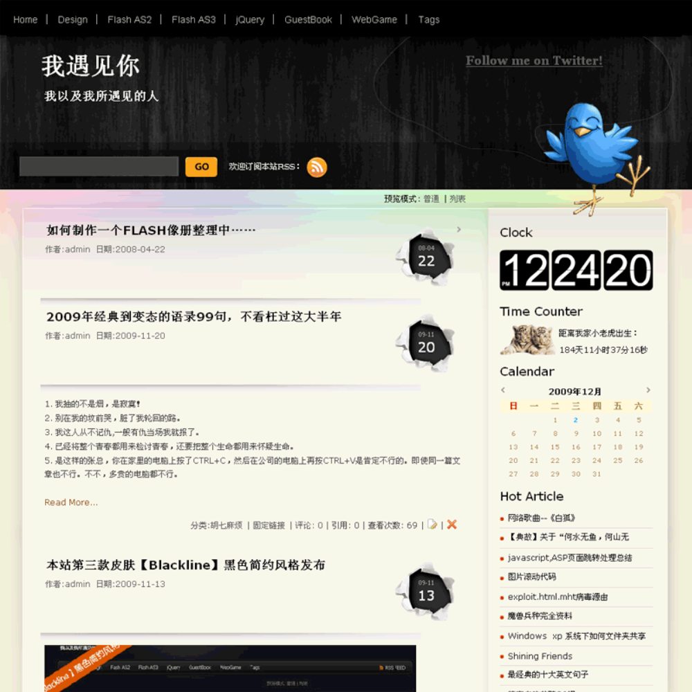

## 博客介绍

追溯博客记录，大概从2006年就开始，最早使用 [pjblog](http://bbs.pjhome.net/),
也因为喜欢，出过几款还算可以的博客主题皮肤。一直使用了好多年，那个时候没有发现 markdown

后来转战 [jeklly](http://jekyllcn.com/),老博客内容未转录，封存到了老电脑💻上面，就断断续续。

还发现一个另人惊艳的博客 [farbox](https://www.farbox.com/) ,可以说是我用过最好最方便的博客系统，后来作者将系统迁移 Bitcron 了，博客的一部分也就留在了farbox，印象中farbox也出过几款皮肤，嘿嘿，😜主题控，不过没翻出来了，其实对我来说，我不想搞什么迁移，就想无缝使用，希望作者继续维护下去吧。

现在主要考虑静态生成，快速部署，从 hexo 又转到了 hugo，综合对比觉得 hugo 在各个方面算是比较理想的了，站点生成速度，打开速度会比较快。

这里记录的学习生活的随笔, 内容比较随意, 大家将就着看。

小小的计划，将之前 pjblog 的皮肤转过 hugo 来

翻出之前论坛的截图，记录一下吧。

